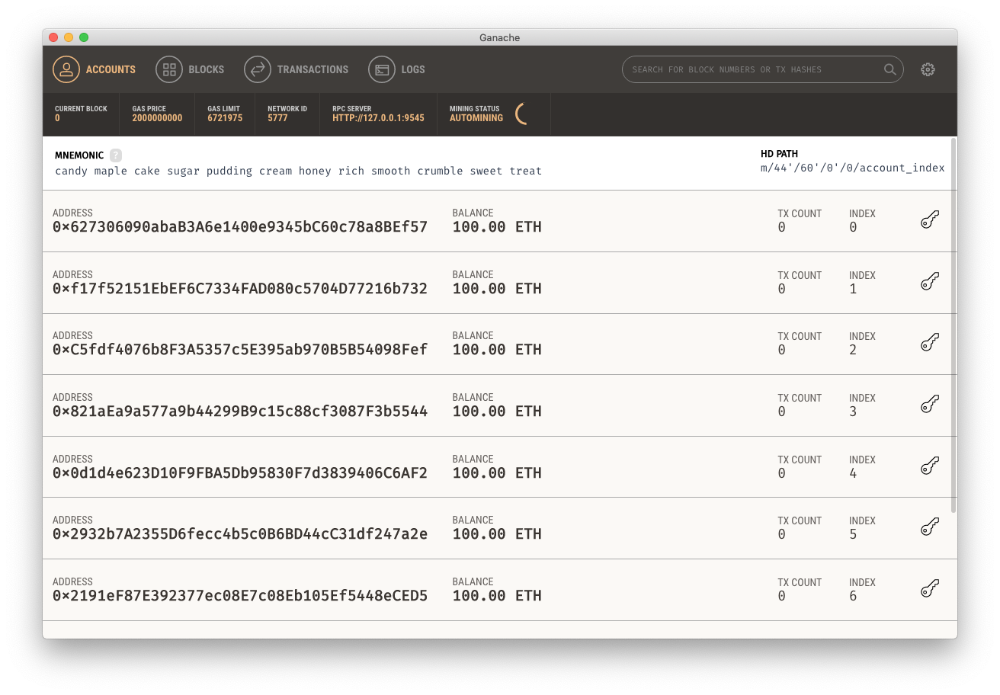
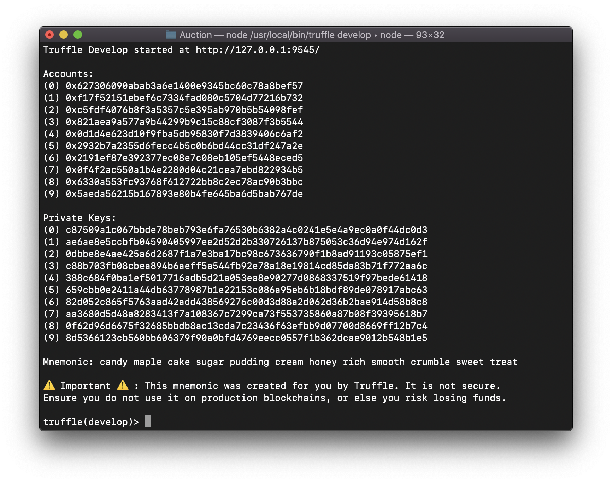
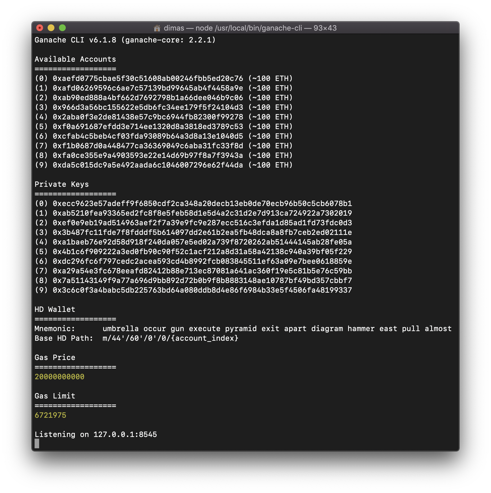
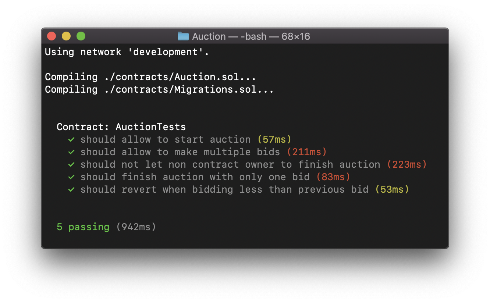

# Тестируем смарт контракты с помощью truffle

Устанавливаем truffle

```
npm install -g truffle@beta
```

Создаём проект Auction

```
mkdir Auction
cd Auction
truffle init
```

Создаём смарт контракт

```
nano contracts/Auction.sol
```

Вставляем туда код смарт контракта

```
pragma solidity ^0.4.19;
contract Auction {
  address public manager;
  address public seller;
  uint public latestBid;
  address public latestBidder;
 
  constructor() public {
    manager = msg.sender;
  }
 
  function auction(uint bid) public {
    latestBid = bid * 1 ether; //1000000000000000000;
    seller = msg.sender;
  }
 
  function bid() public payable {
    require(msg.value > latestBid);
 
    if (latestBidder != 0x0) {
      latestBidder.transfer(latestBid);
    }
    latestBidder = msg.sender;
    latestBid = msg.value;
  }
 
  function finishAuction() restricted public {
    seller.transfer(address(this).balance);
  }
 
  modifier restricted() {
    require(msg.sender == manager);
    _;
  }
}
```

Сохраняем (`ctrl+o`) и закрываем файл (`ctrl+x`)

Можем скомпилировать код, чтобы проверить что всё работает

```
truffle compile
```

Пишем нашу сеть в truffle.js

```
module.exports = {
  // See <http://truffleframework.com/docs/advanced/configuration>
  // to customize your Truffle configuration!
  networks: {
    “development”: {
      network_id: 2,
      host: “localhost”,
      port: 9545
    },
  }
};
```

## Запускаем тестовую ноду
Есть несколько разных нод, которые отличаются производительностью и солидити ассемблером. 

> Ассемблер в truffle и ganache ноде отличаются от mainnet ноды, поэтому лучше на них не тестировать код, где используется ассемблер (что само по себе редкий случай). Для этого используйте geth или parity

### Ganache

Лучше всего использовать Ganache для тестов, так как здесь отображается текущий баланс и количество транзакций в реальном времени

Ganache можно скачать [здесь](http://truffleframework.com/ganache/)



### Truffle и Ganache-cli

Так же есть терминальные ноды от truffle и ganache. По сути они ничем друг от друга не отличаются

#### Чтобы запустить truffle ноду, пишем:

```
truffle develop
```



#### Ganache-cli

Устанавливаем

```
npm install -g ganache-cli
```

Запускаем

```
ganache-cli --port 9545
```




### Пишем тест

Создаём файл `test/Auction.js`

```
// Импортируем интерфейс смарт контракта, который генерирует truffle
const Auction = artifacts.require('Auction');

// Пишем на него тест
contract('AuctionTests', async(accounts) => {
  let auction;

  // Перед каждым тестом создаёи новый контракт
  beforeEach(async function () {
    auction = await Auction.new();
  });

  // И собственно сами тесты
  it('should allow to start auction', async() => {
    await auction.auction('1')
  });
  
  it('should allow to make multiple bids', async() => {
    await auction.auction('1')
    await auction.bid({from: accounts[1], value: '2'});
    await auction.bid({from: accounts[2], value: '3'});
    await auction.bid({from: accounts[1], value: '4'});
    await auction.finishAuction();
  })
  it('should not let non contract owner to finish auction', async() => {
    await auction.auction('1', {from: accounts[1]})
    await auction.bid({from: accounts[1], value: '2'});
    await auction.bid({from: accounts[2], value: '3'});
    await auction.bid({from: accounts[1], value: '4'});
    await assertRevert(auction.finishAuction({from: accounts[1]}));
    await assertRevert(auction.finishAuction({from: accounts[2]}));
    await assertRevert(auction.finishAuction({from: accounts[5]}));
    await auction.finishAuction({from: accounts[0]});
  });
  it('should finish auction with only one bid', async() => {
    await auction.auction('100');
    await auction.bid({from: accounts[1], value: '110'})
    await auction.finishAuction();
  })
  it('should revert when bidding less than previous bid', async() => {
    await auction.auction('100');
    await assertRevert(auction.bid({value: '99'}));
  })
})

async function assertRevert (promise) {
    try {
        await promise;
    } catch (error) {
        const revertFound = error.message.search('revert') >= 0;
        assert(revertFound, `Expected "revert", got ${error} instead`);
        return;
    }
    assert.fail('Expected revert not received');
}
```

### Запускаем тест

```
truffle test
```


